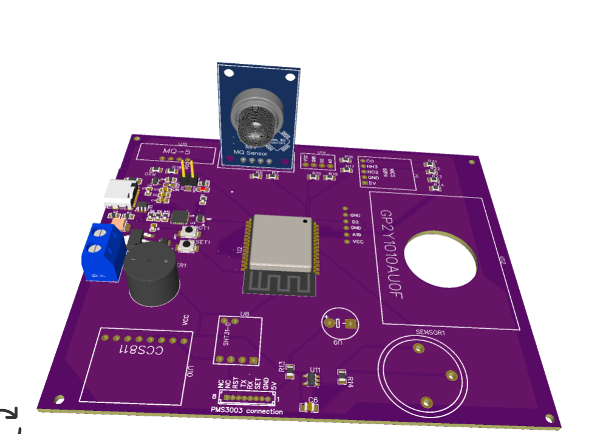

# 🌫️ Air Quality Monitoring System

An ESP32-based smart air quality monitor integrating multiple sensors and a web-based real-time dashboard via MySQL. Designed for 9+ hours battery backup with hybrid power supply.

## 📐 Specifications

- **Controller**: ESP32
- **Sensors**:
  - MQ2, MQ5, MQ135
  - SHT32, MIC6814
  - PMS3003, MHZ19B
- **Display**: OLED
- **Communication**: Wi-Fi, MySQL dashboard
- **Power**: Hybrid (Rechargeable + USB)
- **Battery Backup**: ~9 hours
- **Platform**: VS Code + PlatformIO
- **Design Tool**: EasyEDA
- **Tested**: ✅ Yes

## 📷 Images

  

---
🔙 [Back to Main Portfolio](../../README.md)
