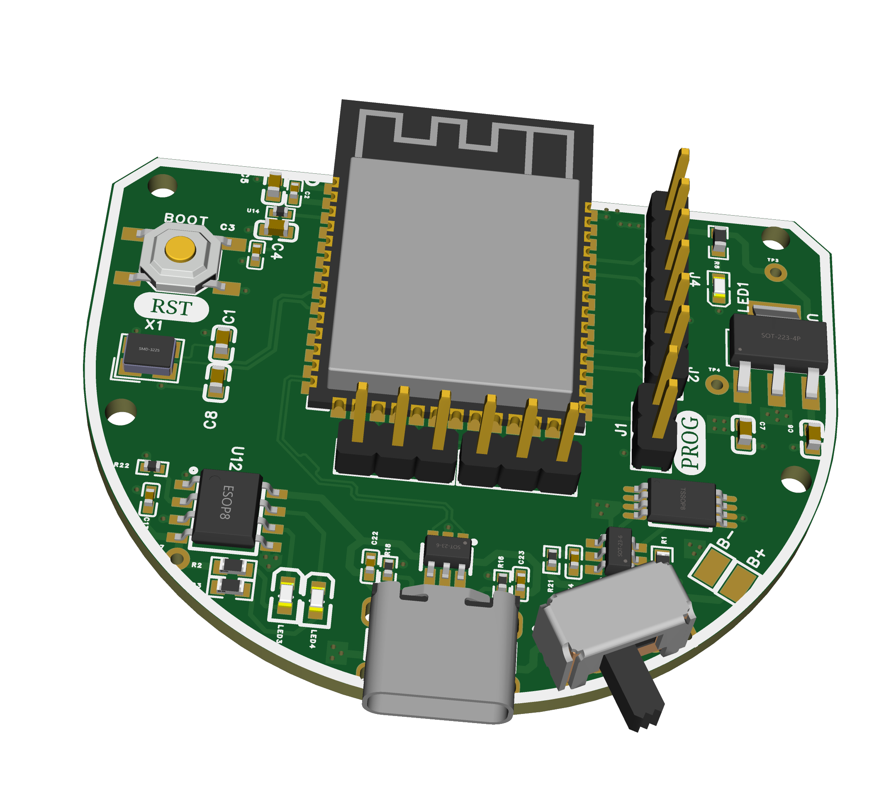

# 🖱️ Ergonomic Mouse – Internal PCB Design

A semi-circular ergonomic mouse PCB built around the ESP32-S3, designed for USB connectivity and comfort-focused enclosure integration. The board is optimized for compactness and fabricated on a double-layer FR4 PCB.

## 📐 Specifications

- **Microcontroller**: ESP32-S3
- **Connectivity**: USB, UART
- **Shape**: Semi-circular
- **Layers**: 2
- **Design Tool**: EasyEDA Pro
- **Fabrication**: JLCPCB
- **Tested**: ✅ Yes

## 📷 Images

---
🔙 [Back to Main Portfolio](../../README.md)
