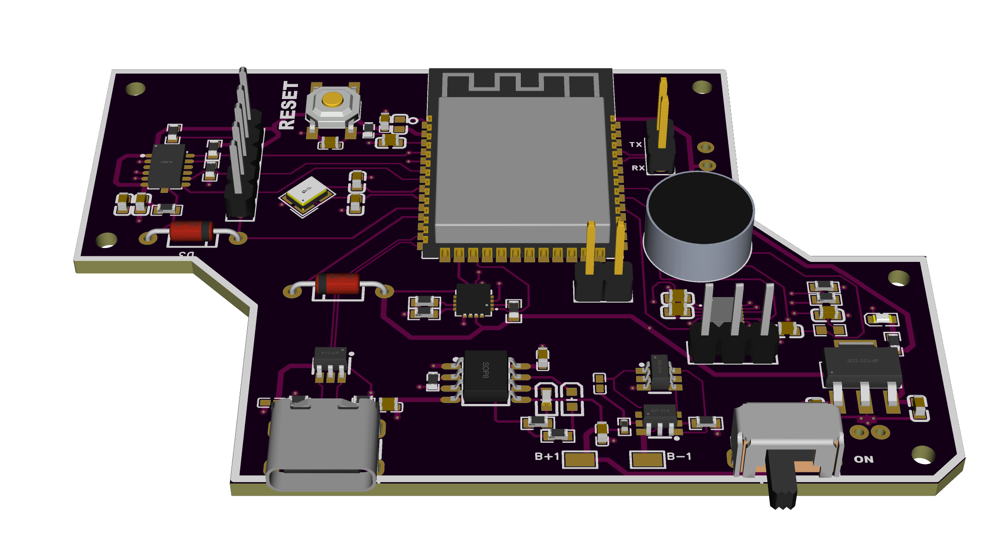

# 🔷 ESP32 Sensor Integration Board

A custom board designed to integrate an accelerometer, magnetometer, and acoustic sensor on a single ESP32-based platform. Ideal for motion and environment-sensing applications.

## 📐 Specifications

- **Microcontroller**: ESP32
- **Sensors**: Accelerometer, Magnetometer, Acoustic Sensor
- **Power**: Single-cell battery with 1S BMS
- **Connectivity**: USB, UART
- **Design Tool**: EasyEDA Pro
- **Fabricated**: ✅ Yes
- **Tested**: ✅ Yes

## 📷 Images

---
🔙 [Back to Main Portfolio](../../README.md)
