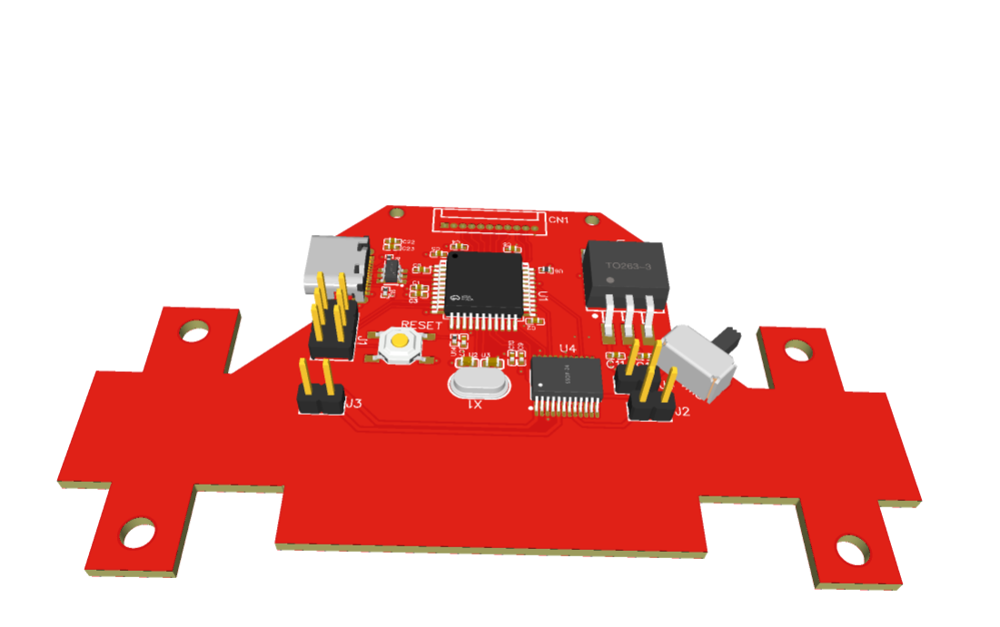

# 🤖 Line Following Robot – Controller Board

A robot controller PCB designed to interface with IR sensor arrays and drive motors via dual motor drivers. Built around the STM32F103C8T6 for efficient real-time performance.

## 📐 Specifications

- **Microcontroller**: STM32F103C8T6
- **Motor Driver**: TB66FNG
- **Sensors**: 5-channel IR (TCRT5000)
- **Power**: Li-Po battery with buck converter
- **Design Tool**: EasyEDA
- **Layers**: 2
- **Tested**: ✅ Yes

## 📷 Images

---
🔙 [Back to Main Portfolio](../../README.md)
