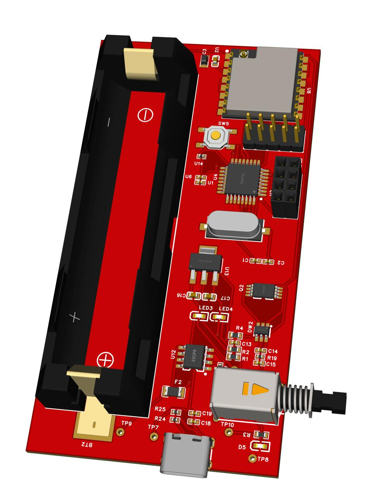

# 📡 LoRa P2P Communication Device

A long-range peer-to-peer wireless communication module using LoRa and Atmega328P. Designed for outdoor and remote deployments with a 10 km range and SMA antenna support.

## 📐 Specifications

- **LoRa Module**: SX1278
- **Microcontroller**: Atmega328P
- **Range**: Up to 10 km (tested)
- **Power**: Single-cell Li-ion battery
- **Size**: < 10cm × 10cm
- **Layers**: 2
- **Antenna**: SMA connector + external whip
- **Use Case**: QR Code Scanner Communication
- **Design Tool**: EasyEDA
- **Tested**: ✅ Yes

## 📷 Images

---
🔙 [Back to Main Portfolio](../../README.md)
